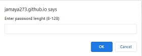
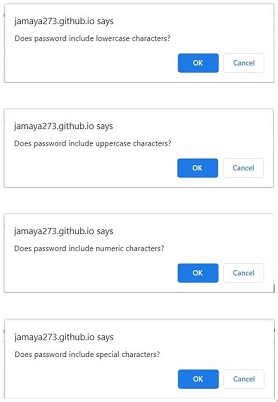
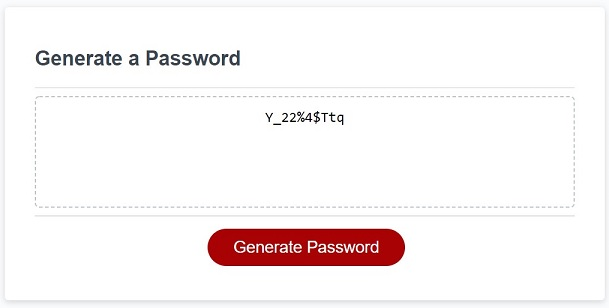

# Generate Password Project

This Project was created to demonstrate the use of JavaScript in small interactive applications. In this application https://jamaya273.github.io/GeneratePassword/ the user clicks a button to generate a random password. The user specifies the criteria that the password must meet and after executing the logic in JavaScript the password is presented to the user. 

## Criteria must be entered on these prompts

Password length:

Character type:

---

## About the program

Using functions in JavaScript makes it easy to design and maintain programs, in this project we have used a function to create the random password. The first step of the program is to initialize 4 arrays with the possible characters to form the password, lowercase, uppercase, digits and special characters. Then randomly select one of the 4 to generate a character in turn also random within each array. 

At the end of the process the password is validated to know if it contains all character types selected by the user, if this condition is not met, the password is regenerated by running the cycle that generates it again. A clause has been added to ensure that the cycle will not repeat indefinitely.

---
## Application result

This is a sample result from the application. It is a 12-character password that includes all 4 character types.

A practical use for this program would be to use it to create robust passwords with characters that are not related to the user's decision, thus increasing the level of security within an organization.

